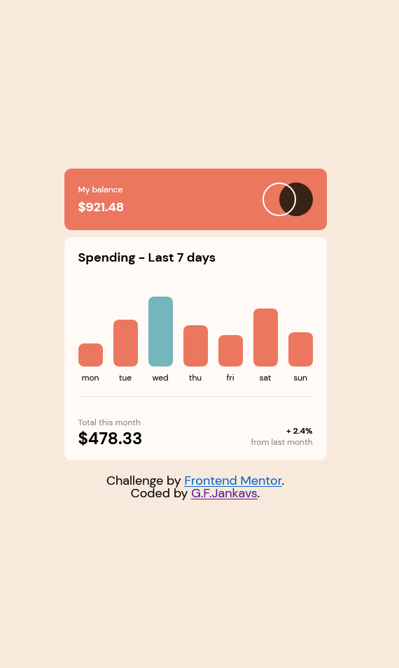

# Frontend Mentor - Expenses chart component solution

This is a solution to the [Expenses chart component challenge on Frontend Mentor](https://www.frontendmentor.io/challenges/expenses-chart-component-e7yJBUdjwt). Frontend Mentor challenges help you improve your coding skills by building realistic projects. 

## Table of contents

- [Overview](#overview)
  - [The challenge](#the-challenge)
  - [Screenshot](#screenshot)
  - [Links](#links)
- [My process](#my-process)
  - [Built with](#built-with)
  - [What I learned](#what-i-learned)
- [Author](#author)
- [Acknowledgments](#acknowledgments)

## Overview

### The challenge

Users should be able to:

- View the bar chart and hover over the individual bars to see the correct amounts for each day
- See the current day’s bar highlighted in a different colour to the other bars
- View the optimal layout for the content depending on their device’s screen size
- See hover states for all interactive elements on the page
- **Bonus**: Use the JSON data file provided to dynamically size the bars on the chart

### Screenshot

### Links

- Live Site URL: [Github Pages](https://your-live-site-url.com)

## My process

### Built with

- HTML5
- CSS
- JavaScript

### What I learned

There wasn't much learned when doing this project. Rather it was a nice opportunity to freshen up my code knowledge and skills.

## Author

- Frontend Mentor - [@GFJankavs](https://www.frontendmentor.io/profile/GFJankavs)
- Twitter - [@GFJankavs](https://twitter.com/GFJankavs)

## Acknowledgments

Thanks goes to the great developers who have provided solutions on StackOverflow.
